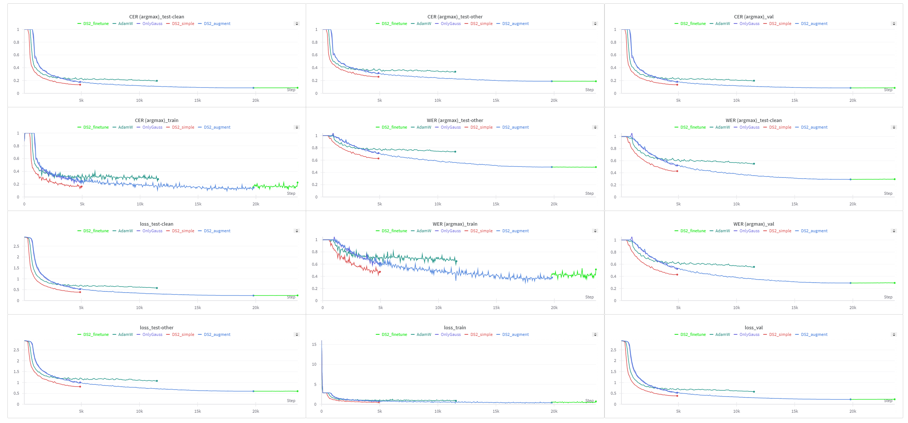
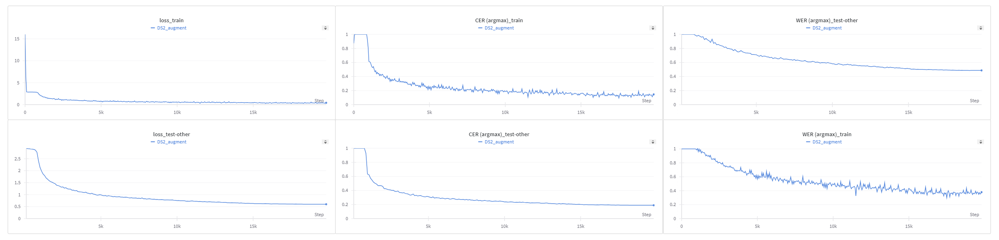

# Summary

## Что удалось выбить
### Beamsearch + LM:
- Test-other WER: 0.3175254338779881
- Test-other CER: 0.15362079583312357
- Test-clean WER: 0.1363561761348809
- Test-clean CER:  0.05193440462660347

В моем понимании это должно быть похоже на что-то приближенное к 8(из-за test-other WER), но судьба решила иначе


## Что было сделано дополнительно
- Написал тесты на ctc_beamsearch 
- Добавил LM для инференса моделей
- Перевез проект на poetry, добавил Makefile с командами для установки всего необходимого, linter, formatter для чистого кода
- Добавил 4 аугментации - FrequencyMasking, TimeMasking, GaussianNoise, PitchShift 
- Добавил логгирование аудио после аугментаций

## Experimental Setup
Для экспериментов я выбрал архитектуру DeepSpeech2

```
DeepSpeech2(
  (conv): Sequential(
    (0): Conv2d(1, 32, kernel_size=(11, 41), stride=(1, 1), padding=same)
    (1): BatchNorm2d(32, eps=1e-05, momentum=0.1, affine=True, track_running_stats=True)
    (2): Conv2d(32, 32, kernel_size=(11, 21), stride=(1, 1), padding=same)
    (3): BatchNorm2d(32, eps=1e-05, momentum=0.1, affine=True, track_running_stats=True)
  )
  (rnn): GRU(4096, 800, num_layers=5, batch_first=True, bidirectional=True)
  (fc): Sequential(
    (0): Linear(in_features=1600, out_features=1600, bias=True)
    (1): ReLU()
    (2): Linear(in_features=1600, out_features=28, bias=True)
  )
)
Trainable parameters: 72486396
```

Все эксперименты проводились на RTX3090

## Experiments motives
Эксперименты проводились в следующем порядке:
- **[Эксперимент DS2_simple]** Кажется, что самым наивным, но тем не менее требующим самых жестких усилий оказался шаг к запуску DeepSpeech2. Я взял базовый конфиг и поставил обучаться 50 эпох. 
- **[Эксперимент DS2_augment]** Как только обычная модель запустилась, я решил добавить аугментаций и сразу увеличить число эпох до 200, затем пойти спать. На утро я был приятно удивлен, потому что даже без beamsearch модели удалось набрать хороший скор. 
- **[Эксперимент OnlyGauss]** Ошарашенный успехом аугментаций я решил попробовать увеличить вероятность гауссовского шума и оставить только его. Отработав 50 эпох он не показал разницы с экспериментом DS2_augment, так что был остановлен досрочно
- **[Эксперимент AdamW]** Довольно часто AdamW работает лучше обычного Adam, поэтому решил попробовать заменить оптимизатор, но к сожалению он показал себя хуже
- **[Эксперимент DS2_finetune]** Как только я реализовал beamsearch+LM, я решил что нужно еще увеличить WER, так что поменял датасеты для обучения на dev-other и train-other и поставил обучение на еще 50 эпох, но остановил на 236 эпохе, так как не наблюдал изменений, а до дедлайна оставалось совсем мало. Ожидания не оправдались(

## Графики метрик



# Final model 
Финальная модель в итоге это мой второй эксперимент - DS2_augment

## Архитектура 

```
DeepSpeech2(
  (conv): Sequential(
    (0): Conv2d(1, 32, kernel_size=(11, 41), stride=(1, 1), padding=same)
    (1): BatchNorm2d(32, eps=1e-05, momentum=0.1, affine=True, track_running_stats=True)
    (2): Conv2d(32, 32, kernel_size=(11, 21), stride=(1, 1), padding=same)
    (3): BatchNorm2d(32, eps=1e-05, momentum=0.1, affine=True, track_running_stats=True)
  )
  (rnn): GRU(4096, 800, num_layers=5, batch_first=True, bidirectional=True)
  (fc): Sequential(
    (0): Linear(in_features=1600, out_features=1600, bias=True)
    (1): ReLU()
    (2): Linear(in_features=1600, out_features=28, bias=True)
  )
)
Trainable parameters: 72486396

```

## Метрики и лосс



# Language Model
В качестве LM для улучшения предсказаний я выбрал модельку отсюда. Для реализации декодирования с помощью языковой модели я выбрал pyctcdecode. В параметрах декодера можно указывать alpha и beta, которые я попытался перебрать по dev-other части, но лучше дефолтных у меня не получилось. Также в decode можно указать beam width, в финальном подсчете метрик я использовал 512. Также я пробовал модель 3-gram отсюда, но качество ухудшилось, вот здесь имело смысл подбирать alpha и beta.
Также я пробовал завести torch реализацию ctcdecoder отсюда, но как бы я там не подбирал параметры декодера, результаты были ужасны.

